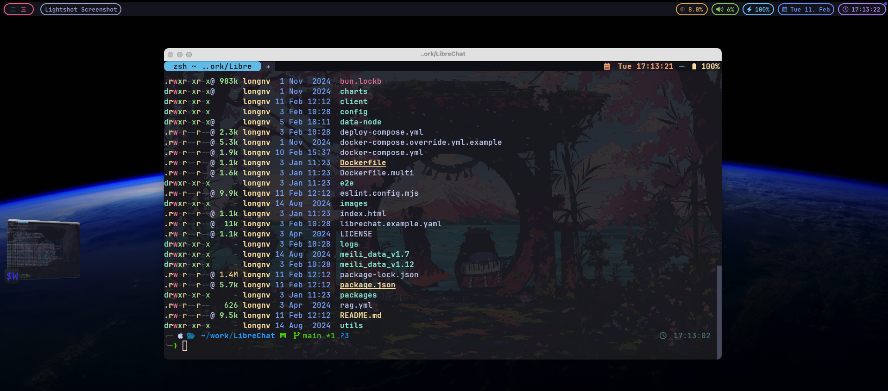
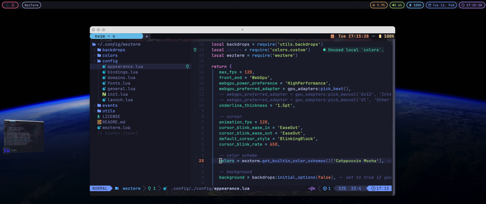
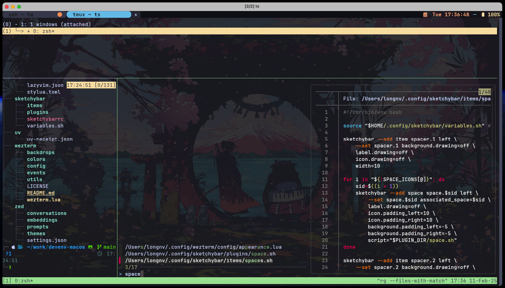
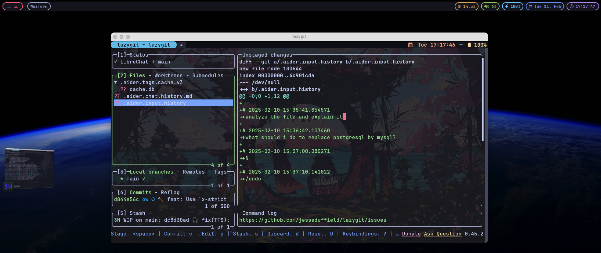
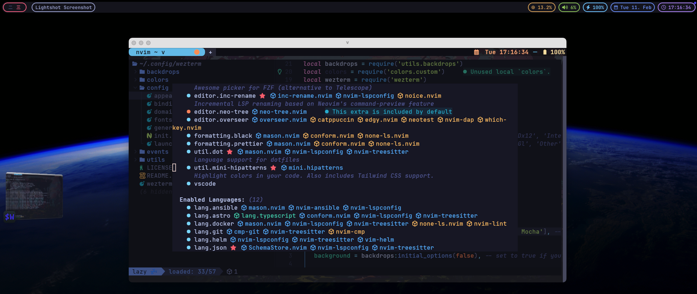
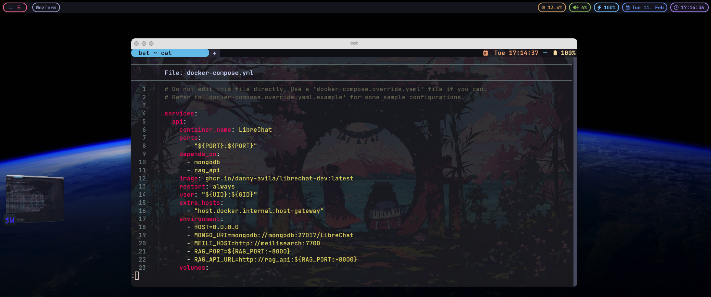
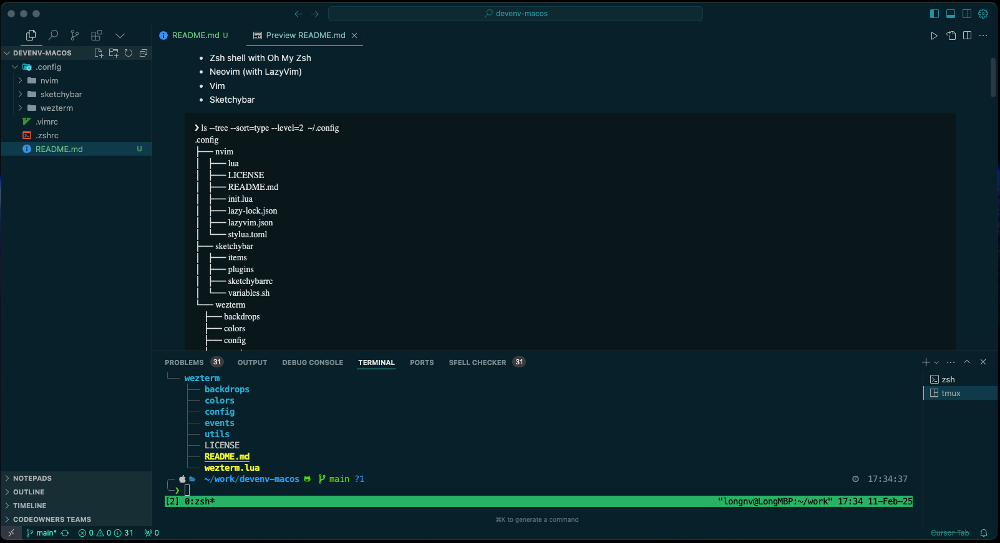
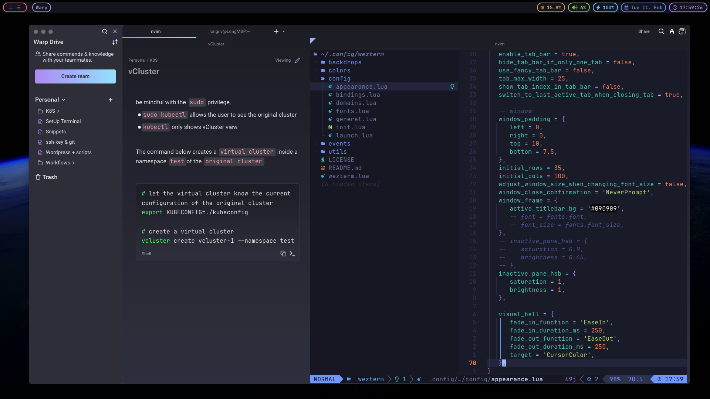

## Introduction

This repository contains my personal dotfiles for setting up a development environment on macOS. It includes configurations for:
- [WezTerm](https://wezterm.org) (if you are new to Terminal and prefer built-in AI features in CLI, use [Warp](https://app.warp.dev/referral/REQYP5) instead). A default MacOS Terminal should work, too.
- Zsh shell with Oh My Zsh
- Neovim (with LazyVim)
- Vim
- Sketchybar
```
❯ ls --tree --sort=type --level=2  ~/.config
.config
├── nvim
│   ├── lua
│   ├── LICENSE
│   ├── README.md
│   ├── init.lua
│   ├── lazy-lock.json
│   ├── lazyvim.json
│   └── stylua.toml
├── sketchybar
│   ├── items
│   ├── plugins
│   ├── sketchybarrc
│   └── variables.sh
└── wezterm
    ├── backdrops
    ├── colors
    ├── config
    ├── events
    ├── utils
    ├── LICENSE
    ├── README.md
    └── wezterm.lua
```
## Screenshots

| Sketchybar | WezTerm, Warp | Neovim, LazyGit | Tmux |
|----------------------|---------------------|----------------|---------|
|  |  |  |  |
|  |  |  |  |

## Prerequisites

Before installing these dotfiles, ensure you have the following installed:

### Required Tools
- Git
- Homebrew
- Zsh (default shell for macOS)
- Oh-my-zsh

### Package Dependencies

All required packages are managed through Homebrew Bundle. To install all dependencies:

```bash
# Install Homebrew if you haven't already
/bin/bash -c "$(curl -fsSL https://raw.githubusercontent.com/Homebrew/install/HEAD/install.sh)"

# Install all dependencies from Brewfile
brew bundle install
```

To update the Brewfile with your current packages:
```bash
brew bundle dump
```

## Components

### Shell (Zsh)

The Zsh configuration includes:

- Oh My Zsh as the framework
- Powerlevel10k theme
- Plugins:
  - kubectl
  - git
  - fzf-tab
  - zsh-syntax-highlighting
  - zsh-autosuggestions

#### Installation

1. Install Oh My Zsh:
```bash
sh -c "$(curl -fsSL https://raw.githubusercontent.com/ohmyzsh/ohmyzsh/master/tools/install.sh)"
```

2. Install Powerlevel10k theme:
```bash
git clone --depth=1 https://github.com/romkatv/powerlevel10k.git ${ZSH_CUSTOM:-$HOME/.oh-my-zsh/custom}/themes/powerlevel10k
```

3. Install additional plugins:
```bash
git clone https://github.com/zsh-users/zsh-syntax-highlighting.git ${ZSH_CUSTOM:-~/.oh-my-zsh/custom}/plugins/zsh-syntax-highlighting
git clone https://github.com/zsh-users/zsh-autosuggestions ${ZSH_CUSTOM:-~/.oh-my-zsh/custom}/plugins/zsh-autosuggestions
git clone https://github.com/Aloxaf/fzf-tab ${ZSH_CUSTOM:-~/.oh-my-zsh/custom}/plugins/fzf-tab
```

### Neovim

The Neovim configuration uses LazyVim as the base with additional customizations:

- Package manager: lazy.nvim
- Theme: tokyonight-moon
- LSP support for multiple languages
- Various coding and UI enhancements

Follow the instruction from [LazyVim for Ambitious Developers](https://lazyvim-ambitious-devs.phillips.codes).

### Sketchybar

Customize your MacOS's menu bar.

```bash
mkdir -p ~/.config/sketchybar/plugins
cp $(brew --prefix)/share/sketchybar/examples/sketchybarrc ~/.config/sketchybar/sketchybarrc
cp -r $(brew --prefix)/share/sketchybar/examples/plugins/ ~/.config/sketchybar/plugins/
```

### Others
- [Rust](https://www.rust-lang.org/)
```bash
curl --proto '=https' --tlsv1.2 -sSf https://sh.rustup.rs | sh
```

## Credits

The configurations builds upon these amazing projects:

- [Neovim](https://github.com/neovim/neovim) - Hyperextensible Vim-based text editor
- [LazyVim](https://github.com/LazyVim/LazyVim) - Neovim config for the lazy
- [WezTerm](https://github.com/wez/wezterm) - A GPU-accelerated cross-platform terminal emulator
- [Sketchybar](https://github.com/FelixKratz/SketchyBar) - A highly customizable macOS status bar replacement
- [Oh My Zsh](https://github.com/ohmyzsh/ohmyzsh) - A delightful community-driven framework for Zsh
- [Powerlevel10k](https://github.com/romkatv/powerlevel10k) - A fast and feature-rich Zsh theme

Special thanks to these individuals for sharing the config files and writing.

- KevinSilvester: [wezterm-config](https://github.com/KevinSilvester/wezterm-config)
- Michael Bao: [tcmmichaelb139/.dotfiles](https://github.com/tcmmichaelb139/.dotfiles)
- Dusty Phillips: [LazyVim for Ambitious Developers](https://lazyvim-ambitious-devs.phillips.codes)

## License

This project is licensed under the MIT.