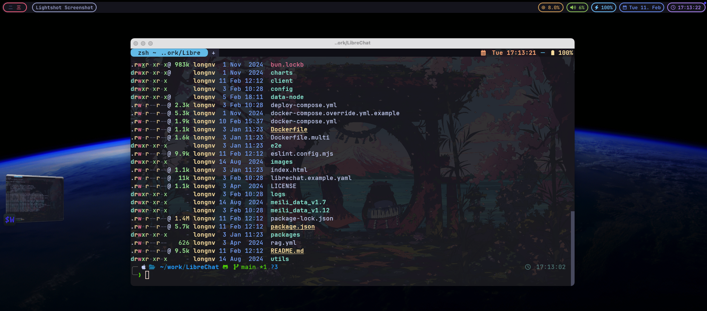
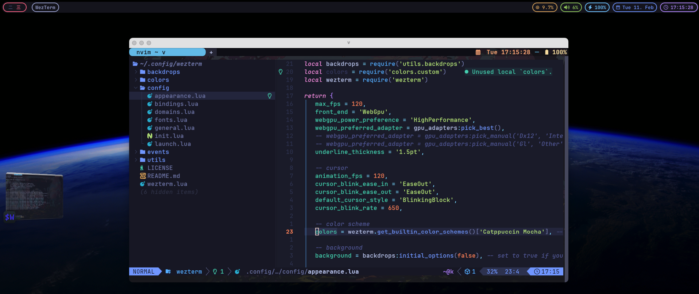
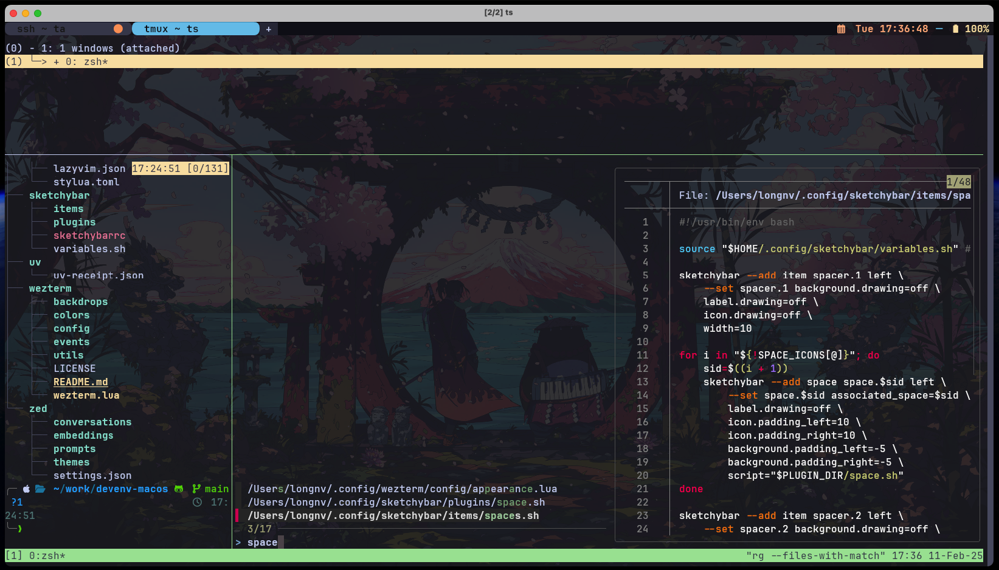
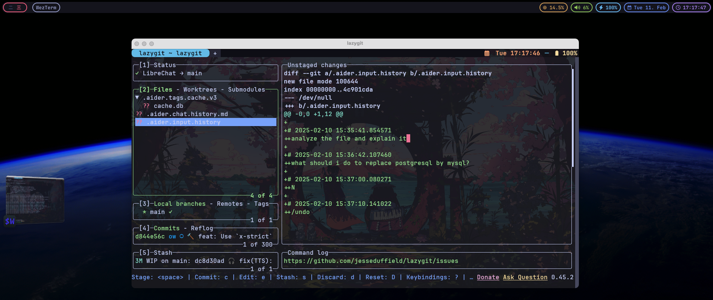
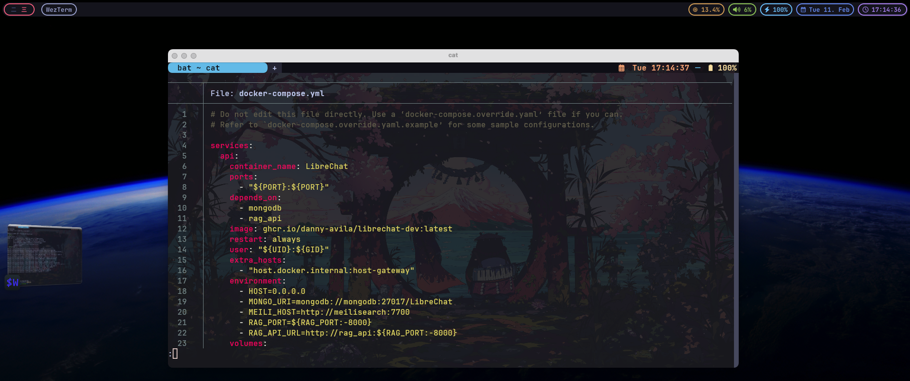
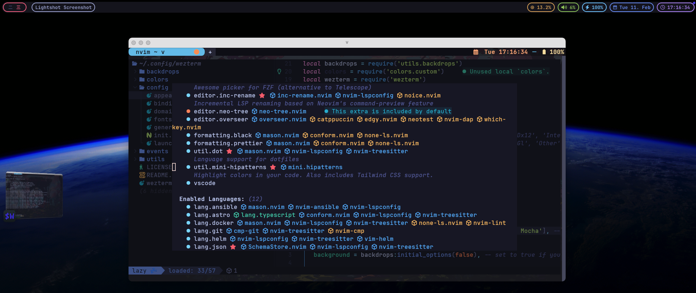
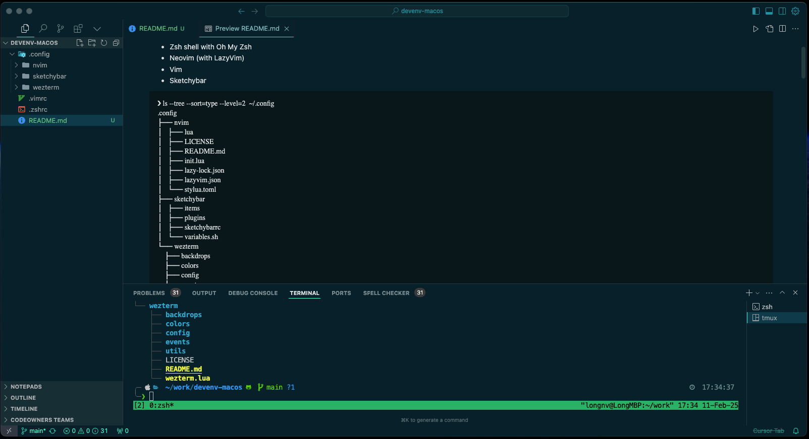
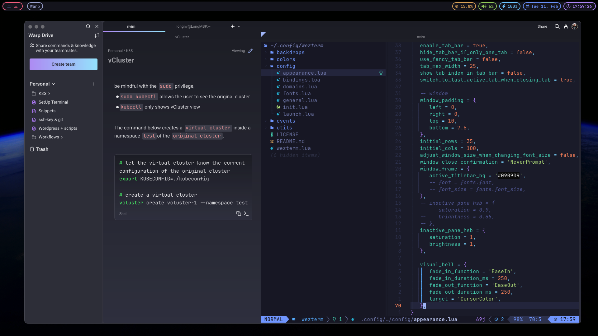

# Development environment for macOS users

## Introduction

My personal dotfiles for setting up a development environment on macOS.

> Prefer zsh over fish? Use the [zsh branch](https://github.com/nguyenvulong/devenv-macos/tree/zsh) instead.

- Terminal
  - [cmux](https://www.cmux.dev/), the Ghostty-based terminal for AI coding agents, or
  - [Warp](https://app.warp.dev/referral/REQYP5), for built-in AI features, or
  - [Ghostty](https://ghostty.org), the elegant Zig-based terminal
- Shell: Fish with the Starship prompt
- Neovim (with LazyVim) and vim
- Sketchybar

| Shell                                                        | Neovim                                                       | Tmux                                                              | LazyGit                                                       |
| ------------------------------------------------------------ | ------------------------------------------------------------ | ----------------------------------------------------------------- | ------------------------------------------------------------- |
|   |  |         |  |
| **Shell**                                                    | **Neovim**                                                   | **VS Code + Tmux**                                                | **Warp**                                                      |
|   |  |  |     |

## Getting started

### 1. Install Homebrew

If you don't have Homebrew yet:

```bash
/bin/bash -c "$(curl -fsSL https://raw.githubusercontent.com/Homebrew/install/HEAD/install.sh)"
```

### 2. Clone the repository

```bash
git clone https://github.com/nguyenvulong/devenv-macos.git ~/devenv-macos
cd ~/devenv-macos
```

### 3. Run the install script

```bash
./install.sh            # install Homebrew packages and link the configs
./install.sh --dry-run  # preview what would change
./install.sh --shell    # also set fish as the login shell
```

The script installs everything in the `Brewfile` and symlinks `fish`, `ghostty`, `nvim`, `sketchybar`,
`starship.toml` and `.vimrc` into your home directory. Existing files are moved to
`~/.dotfiles-backup/<timestamp>/` first, and running it again is safe. Run `./install.sh --help` for all options.

### 4. (Optional) Manage packages yourself

If you'd rather not use the script, install the packages with Homebrew Bundle:

```bash
brew bundle install
```

To regenerate the Brewfile from your current packages:

```bash
brew bundle dump --force
```

### 5. Set up fish as your shell

After the install, just execute `fish` and confirm the settings for the first time.
Make sure to check the configuration in `~/.config/fish/config.fish` and `~/.config/starship.toml`,
then you're good to go.

To set fish as a login shell (or run `./install.sh --shell`):

```bash
echo "$(brew --prefix)/bin/fish" | sudo tee -a /etc/shells
chsh -s "$(brew --prefix)/bin/fish"
```

Then restart your terminal.

### 6. Configure Neovim

The Neovim configuration uses LazyVim as the base with additional customizations:

- Package manager: lazy.nvim
- Theme: tokyonight-moon
- LSP support for multiple languages
- Various coding and UI enhancements
- Extra plugins: undotree (`<leader>U`), rainbow_csv, markdown-preview
- Clipboard: system clipboard locally, OSC 52 over SSH

Plugins are installed automatically the first time you start `nvim`. Plugin versions are pinned in
`lazy-lock.json`; run `:Lazy restore` to install exactly those versions, or `:Lazy update` to upgrade them
and commit the updated lock file.

### 7. Start Sketchybar

The Sketchybar config is already linked by the install script, so just start the service:

```bash
brew services start sketchybar
```

To hide the default macOS menu bar, enable **System Settings → Control Center → Automatically hide and show the menu bar → Always**.

## Credits

The configurations build upon these amazing projects:

- [Neovim](https://github.com/neovim/neovim) - Hyperextensible Vim-based text editor
- [LazyVim](https://github.com/LazyVim/LazyVim) - Neovim config for the lazy
- [Ghostty](https://ghostty.org) - GPU-accelerated cross-platform terminal emulator
- [Sketchybar](https://github.com/FelixKratz/SketchyBar) - A highly customizable macOS status bar replacement
- [Fish](https://fishshell.com) - The user-friendly command line shell
- [Starship](https://starship.rs) - A minimal, blazing-fast, and infinitely customizable prompt for any shell

Special thanks to these individuals for sharing the config files and writing.

- Michael Bao: [tcmmichaelb139/.dotfiles](https://github.com/tcmmichaelb139/.dotfiles)
- Dusty Phillips: [LazyVim for Ambitious Developers](https://lazyvim-ambitious-devs.phillips.codes)

## License

This project is licensed under the [MIT License](./LICENSE).
